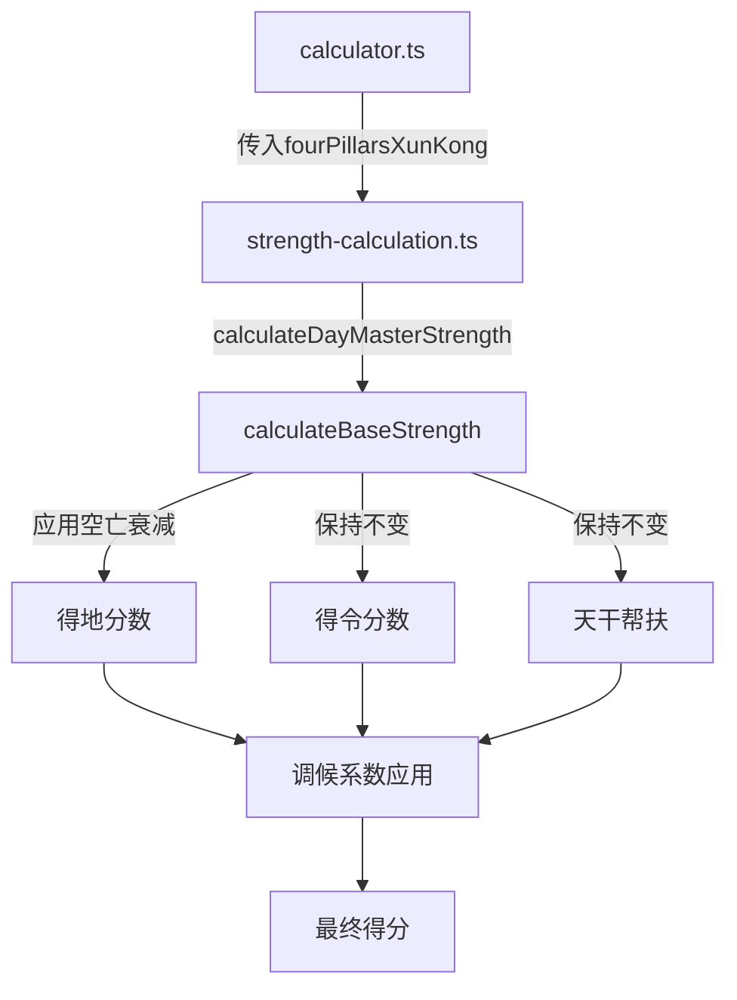

## 用户需求

用户关注八字命盘的静态准确性,特别是五行分布和格局判定。经分析发现当前系统存在两个问题:

1. 前端已经展示空亡标识,但后端算法中对空亡地支的得地分数未进行衰减,导致日主强弱和五行分数虚高
2. 需要验证特殊格局的判定和显示逻辑是否正常工作

## 产品概述

通过修复空亡算法缺失问题,使后端计算的日主强弱分数、五行分布分数更加准确,让前端展示的空亡标识与后端算法逻辑保持一致。同时验证特殊格局的显示功能是否正常。

## 核心功能

1. 在日主强弱计算中引入空亡衰减机制,对空亡地支的得地分数进行0.3倍衰减
2. 修改相关函数签名,在调用链中传递空亡数据
3. 验证特殊格局判定逻辑的完整性
4. 确保修改后的算法与现有冲害、调候逻辑兼容

## 技术栈

基于现有项目技术栈:

- TypeScript
- Node.js
- lunar-typescript 库(命理计算)
- Vitest(单元测试)

## 实现方案

### 核心策略

采用最小侵入式修改策略,在现有得地分数计算逻辑中增加空亡检查和衰减机制。选择在 `calculateBaseStrength` 函数中实现,因为这是得地分数计算的核心位置,修改后可以确保所有下游计算都使用修正后的分数。

### 实现细节

#### 1. 空亡衰减系数

根据传统命理学理论和文档建议,空亡地支的能量输出应大幅衰减。采用 `KONG_WANG_ATTENUATION = 0.3` 作为衰减系数,即空亡地支的得地分数降低至原来的30%。

#### 2. 函数签名扩展

在 `strength-calculation.ts` 中:

- `calculateBaseStrength` 新增可选参数 `fourPillarsXunKong?: FourPillarsXunKongInfo`
- `calculateDayMasterStrength` 新增可选参数 `fourPillarsXunKong?: FourPillarsXunKongInfo`

在 `calculator.ts` 中:

- 调用 `calculateDayMasterStrength` 时传入已计算的 `fourPillarsXunKong`

#### 3. 空亡检查逻辑

创建辅助函数:

```typescript
function isEmptyBranch(branch: string, dayXunKong: string): boolean {
  if (!dayXunKong) return false;
  return dayXunKong.includes(branch);
}
```

#### 4. 得地分数修正

在两个分支中应用空亡衰减:

**坐禄分支**:

- 检查日支是否在 `dayXunKong` 中
- 如果空亡,禄位得分乘以0.3
- 在描述中添加"逢空"标注

**藏干分支**:

- 遍历四柱时,对每个地支检查是否空亡
- 空亡地支的藏干得分乘以0.3
- 在根的描述中添加"(空)"标注

#### 5. 执行顺序

空亡修正的执行顺序:

```
1. 计算基础得分(得令、得地、天干帮扶)
2. 在得地计算中应用空亡衰减  ← 新增
3. 应用调候系数
4. 判断从格
5. 返回最终得分
```

### 架构设计

修改涉及的模块关系:



### 关键代码结构

#### constants.ts 新增

```typescript
// 空亡衰减系数
export const KONG_WANG_ATTENUATION = 0.3;
```

#### strength-calculation.ts 修改

```typescript
// 新增辅助函数
function isEmptyBranch(branch: string, dayXunKong?: string): boolean

// 修改函数签名
export function calculateBaseStrength(
  dayStem: HeavenlyStem,
  fourPillars: FourPillars,
  fourPillarsXunKong?: FourPillarsXunKongInfo
): Omit<DayMasterAnalysis, 'seasonalAdjustment'>

// 在坐禄检查中应用空亡
if (luCheck.hasLu) {
  const isEmpty = isEmptyBranch(dayBranch, fourPillarsXunKong?.dayXunKong);
  deDi = isEmpty ? Math.round(luCheck.score * KONG_WANG_ATTENUATION) : luCheck.score;
  // 描述中添加空亡标注
}

// 在藏干遍历中应用空亡
for (const { pillar, name } of allPillars) {
  const isEmpty = isEmptyBranch(branchChinese, fourPillarsXunKong?.dayXunKong);
  const score = weight * baseScore * (isEmpty ? KONG_WANG_ATTENUATION : 1.0);
  // 描述中添加(空)标注
}
```

### 性能考虑

- 空亡检查使用字符串 `includes` 方法,时间复杂度O(n),n为旬空字符串长度(通常为2个字符),性能影响可忽略
- 不增加额外的循环或递归,不影响整体计算性能
- 向后兼容设计,未传入空亡参数时直接跳过检查,零性能开销

### 兼容性保证

1. 参数可选性:所有新增参数均为可选,不传入时算法行为与修改前完全一致
2. 前端无需改动:后端直接返回修正后的分数,前端接收数据的方式不变
3. 测试覆盖:修改后运行现有测试套件,确保未破坏任何现有功能