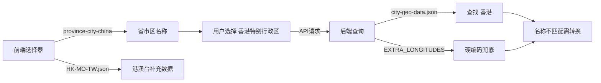
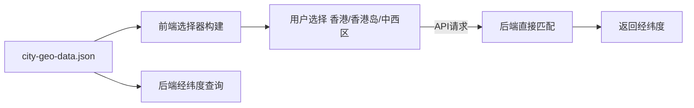
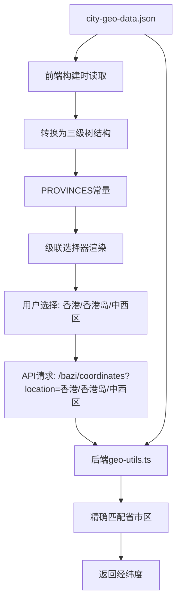

## 产品概述

统一前后端城市地理数据源，解决当前项目中城市数据分散维护和命名不一致的问题。使用完整的 city-geo-data.json（27,026条记录，包含全国所有省市区及其经纬度）作为唯一数据源，实现前后端数据命名一致性，提升数据维护效率。

## 核心功能

- **数据源统一**：前后端统一使用 city-geo-data.json，删除 province-city-china NPM包 和 HK-MO-TW.json 冗余数据源
- **命名一致性**：前端选择器直接使用 city-geo-data.json 中的省市区名称（如"香港"），后端直接匹配，无需名称转换
- **前端选择器重构**：从 city-geo-data.json 构建省/市/区三级级联选择器，保持现有交互体验
- **后端简化**：删除 EXTRA_LONGITUDES 硬编码，依赖完整的 city-geo-data.json 数据
- **架构精简**：减少依赖包，降低前端打包体积，提升代码可维护性

## 技术栈

- **前端框架**: React + JavaScript
- **后端框架**: Hono + TypeScript + Node.js
- **数据源**: city-geo-data.json (27,026条完整的省市区经纬度数据)
- **构建工具**: Vite（前端）、tsx（后端）

## 系统架构

### 当前架构问题



### 目标架构



## 模块划分

### 前端模块

- **数据处理模块** (`frontend/src/utils/cityDataProcessor.js`)
- 职责：从 city-geo-data.json 构建省/市/区三级树结构
- 技术：JavaScript 数据转换
- 输出：符合级联选择器格式的 PROVINCES 数据结构

- **常量模块** (`frontend/src/utils/constants.js`)
- 职责：导出统一的 PROVINCES 数据，删除旧的 province-city-china 和 HK-MO-TW.json 导入
- 依赖：cityDataProcessor 模块

- **表单组件** (`frontend/src/components/bazi/BirthInfoForm/index.jsx`)
- 职责：使用新的 PROVINCES 数据，无需修改交互逻辑
- 依赖：constants 模块

### 后端模块

- **地理工具模块** (`src/lib/bazi/geo-utils.ts`)
- 职责：基于 city-geo-data.json 查询经纬度
- 修改：删除 EXTRA_LONGITUDES 硬编码，优化查询逻辑
- 技术：TypeScript，索引优化

## 数据流



## 实现细节

### 核心目录结构

对于现有项目，仅显示修改或新增的文件：

```
bazi/
├── frontend/
│   ├── src/
│   │   ├── utils/
│   │   │   ├── cityDataProcessor.js  # 新增：数据转换工具
│   │   │   └── constants.js          # 修改：移除旧数据源导入
│   │   └── components/
│   │       └── bazi/
│   │           └── BirthInfoForm/
│   │               └── index.jsx     # 无需修改（继续使用PROVINCES）
│   └── package.json                  # 修改：移除province-city-china依赖
├── src/
│   └── lib/
│       └── bazi/
│           ├── city-geo-data.json    # 保持不变（唯一数据源）
│           └── geo-utils.ts          # 修改：删除EXTRA_LONGITUDES
└── docs/
    └── HK-MO-TW.json                 # 删除：冗余文件
```

### 关键数据结构

**city-geo-data.json 数据格式**（已存在）

```typescript
interface CityGeoItem {
  area: string;      // 区县，如"中西区"
  city: string;      // 城市，如"香港岛"
  province: string;  // 省份，如"香港"
  lat: string;       // 纬度
  lng: string;       // 经度
  country: string;   // 国家
}
```

**前端三级树结构**（目标格式，保持现有选择器兼容）

```javascript
const PROVINCES = [
  {
    value: "香港",           // 省份名称
    label: "香港",           
    cities: [
      {
        value: "香港岛",     // 城市名称
        label: "香港岛",
        districts: [
          { value: "中西区", label: "中西区" },
          { value: "湾仔区", label: "湾仔区" }
        ]
      }
    ]
  }
];
```

### 技术实现方案

#### 1. 前端数据转换实现

**问题**：city-geo-data.json 是平铺的27,026条记录，需要转换为三级树结构
**方案**：创建 cityDataProcessor.js 工具函数
**关键步骤**：

1. 读取 city-geo-data.json
2. 按 province 分组，创建省份节点
3. 在每个省份下，按 city 分组，创建城市节点
4. 在每个城市下，按 area 分组，创建区县节点
5. 处理直辖市特殊情况（北京市、上海市等，省=市）

**实现示例**：

```javascript
// cityDataProcessor.js
import cityGeoData from '../../../src/lib/bazi/city-geo-data.json';

export function buildProvinceTree() {
  const provinceMap = new Map();
  
  cityGeoData.forEach(item => {
    // 获取或创建省份节点
    if (!provinceMap.has(item.province)) {
      provinceMap.set(item.province, {
        value: item.province,
        label: item.province,
        cities: new Map()
      });
    }
    
    const provinceNode = provinceMap.get(item.province);
    
    // 获取或创建城市节点
    if (!provinceNode.cities.has(item.city)) {
      provinceNode.cities.set(item.city, {
        value: item.city,
        label: item.city,
        districts: []
      });
    }
    
    const cityNode = provinceNode.cities.get(item.city);
    
    // 添加区县（去重）
    if (!cityNode.districts.some(d => d.value === item.area)) {
      cityNode.districts.push({
        value: item.area,
        label: item.area
      });
    }
  });
  
  // 转换 Map 为数组
  return Array.from(provinceMap.values()).map(province => ({
    ...province,
    cities: Array.from(province.cities.values())
  }));
}
```

#### 2. 后端geo-utils.ts简化

**问题**：EXTRA_LONGITUDES 硬编码维护成本高
**方案**：依赖完整的 city-geo-data.json，优化查询逻辑
**关键步骤**：

1. 删除第27-47行的 EXTRA_LONGITUDES 常量
2. 删除第70-78行的硬编码合并逻辑
3. 保持现有的索引查询逻辑（areaIndex、cityIndex、provinceIndex）
4. 确保支持带后缀和不带后缀的匹配（如"香港" vs "香港特别行政区"）

**测试策略**：

- 单元测试：验证香港、澳门、台湾地区经纬度查询正确性
- 集成测试：测试前端选择香港地区后，API返回正确经纬度

#### 3. 依赖清理

**问题**：province-city-china 包增加前端打包体积
**方案**：移除 NPM 依赖，使用本地数据
**关键步骤**：

1. 在 frontend/package.json 中删除 "province-city-china": "^8.5.8"
2. 运行 `npm uninstall province-city-china`
3. 删除 docs/HK-MO-TW.json 文件

## 技术考量

### 性能优化

- **前端构建时处理**：在 constants.js 中一次性构建 PROVINCES，避免运行时计算
- **后端索引查询**：保持现有的 Map 索引结构，查询复杂度 O(1)
- **数据去重**：在构建三级树时自动去重，避免重复区县

### 数据一致性

- **命名统一**：前后端使用相同的省市区名称（"香港" 而非 "香港特别行政区"）
- **后向兼容**：在后端查询时，支持模糊匹配（如"香港"可以匹配到"香港特别行政区"），但推荐使用精确名称
- **验证机制**：添加单元测试确保港澳台地区数据完整

### 可扩展性

- **数据更新**：未来只需更新 city-geo-data.json 一个文件
- **新增地区**：自动支持，无需修改代码逻辑
- **国际化扩展**：可在 cityDataProcessor 中添加多语言支持