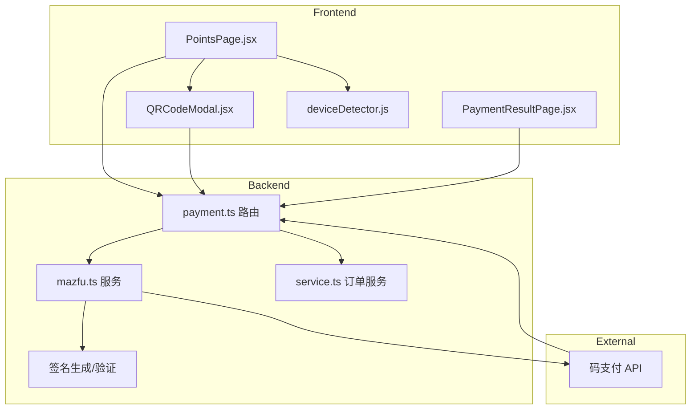
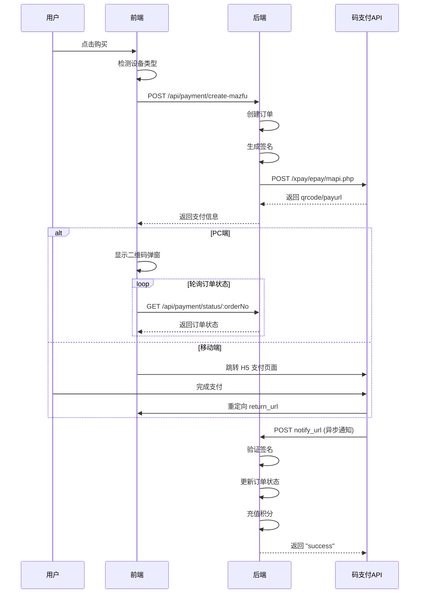

# 设计文档

## 概述

本设计文档描述了码支付（Mazfu）集成的技术实现方案。系统将创建一个新的 `mazfu.ts` 服务模块，实现签名生成、支付请求发起和回调验证功能。前端将根据设备类型提供不同的支付体验：PC 端显示二维码弹窗，移动端跳转 H5 支付页面。

### 设计目标

1. **最小侵入性**: 保留现有 Stripe 代码，仅添加新的码支付模块
2. **设备自适应**: 自动检测设备类型，提供最佳支付体验
3. **安全性**: 严格的签名验证，防止回调伪造
4. **可靠性**: 幂等处理，防止重复充值

## 架构

### 系统架构图



### 支付流程图



## 组件和接口

### 后端组件

#### 1. Mazfu 服务 (`src/lib/payment/mazfu.ts`)

```typescript
/**
 * 码支付配置接口
 */
interface MazfuConfig {
  pid: string;           // 商户ID
  key: string;           // 签名密钥
  apiBaseUrl: string;    // API基础URL
  notifyUrl: string;     // 异步通知URL
  returnUrl: string;     // 同步跳转URL
}

/**
 * 创建支付请求参数
 */
interface CreateMazfuPaymentParams {
  orderNo: string;       // 商户订单号
  amount: number;        // 金额（分）
  productName: string;   // 商品名称
  device: 'pc' | 'mobile'; // 设备类型
  clientIp?: string;     // 客户端IP
}

/**
 * 创建支付请求结果
 */
interface CreateMazfuPaymentResult {
  success: boolean;
  tradeNo?: string;      // 码支付订单号
  qrcode?: string;       // 二维码链接（PC端）
  payurl?: string;       // 支付跳转URL（移动端）
  money?: string;        // 支付金额
  message?: string;      // 错误信息
}

/**
 * 回调通知参数
 */
interface MazfuNotifyParams {
  pid: string;           // 商户ID
  trade_no: string;      // 码支付订单号
  out_trade_no: string;  // 商户订单号
  type: string;          // 支付方式
  name: string;          // 商品名称
  money: string;         // 金额
  trade_status: string;  // 支付状态
  param?: string;        // 业务扩展参数
  sign: string;          // 签名
  sign_type: string;     // 签名类型
}

/**
 * 生成签名
 */
function generateSign(params: Record<string, string>, key: string): string;

/**
 * 验证签名
 */
function verifySign(params: MazfuNotifyParams, key: string): boolean;

/**
 * 创建支付请求
 */
async function createPayment(params: CreateMazfuPaymentParams): Promise<CreateMazfuPaymentResult>;

/**
 * 处理异步通知
 */
async function handleNotify(params: MazfuNotifyParams): Promise<{ success: boolean; message: string }>;
```

#### 2. 支付路由扩展 (`src/routes/payment.ts`)

新增以下路由：

| 方法 | 路径 | 描述 |
|------|------|------|
| POST | /api/payment/create-mazfu | 创建码支付订单 |
| POST | /api/payment/mazfu-notify | 码支付异步通知回调 |
| GET | /api/payment/mazfu-return | 码支付同步跳转回调 |

### 前端组件

#### 1. 设备检测工具 (`frontend/src/utils/deviceDetector.js`)

```javascript
/**
 * 检测设备类型
 * @returns {'pc' | 'mobile'}
 */
function detectDevice(): 'pc' | 'mobile';

/**
 * 检测是否为移动设备
 * @returns {boolean}
 */
function isMobile(): boolean;
```

#### 2. 二维码弹窗组件 (`frontend/src/components/QRCodeModal.jsx`)

Props:
- `visible: boolean` - 是否显示
- `qrCodeUrl: string` - 二维码URL
- `orderNo: string` - 订单号
- `amount: number` - 金额（元）
- `onClose: () => void` - 关闭回调
- `onSuccess: () => void` - 支付成功回调
- `onTimeout: () => void` - 支付超时回调

功能：
- 显示二维码图片
- 显示订单金额
- 5分钟倒计时
- 每3秒轮询订单状态
- 支付成功自动关闭

#### 3. 支付结果页面 (`frontend/src/pages/PaymentResultPage.jsx`)

路由: `/payment/result`

查询参数:
- `order_no` - 订单号
- `trade_status` - 支付状态

功能：
- 显示支付结果（成功/失败）
- 成功时显示充值积分数
- 失败时显示重试按钮
- 自动跳转回积分页面

## 数据模型

### 现有模型复用

系统复用现有的 `PaymentOrder` 模型，无需新增数据表：

```prisma
model PaymentOrder {
  id              String    @id @default(cuid())
  userId          String
  orderNo         String    @unique
  amount          Int       // 金额（分）
  points          Int       // 积分数
  paymentMethod   String    // 'alipay_qrcode' | 'alipay_h5' | 'stripe'
  status          String    // 'pending' | 'paid' | 'failed' | 'refunded'
  transactionId   String?   // 码支付订单号 (trade_no)
  stripeSessionId String?   // Stripe Session ID (保留)
  createdAt       DateTime  @default(now())
  paidAt          DateTime?
  user            User      @relation(fields: [userId], references: [id])
}
```

### 类型扩展

在 `types.ts` 中添加新的支付方式：

```typescript
export type PaymentMethod = 'alipay_qrcode' | 'alipay_h5' | 'stripe';
```

## 正确性属性

*正确性属性是指在系统所有有效执行中都应该保持为真的特征或行为——本质上是关于系统应该做什么的形式化陈述。属性作为人类可读规范和机器可验证正确性保证之间的桥梁。*


### Property 1: 签名生成往返验证

*For any* 有效的参数集合和商户密钥，生成签名后使用相同参数和密钥验证签名 SHALL 返回 true。

**验证: 需求 1.1, 1.2, 1.3, 1.4, 1.5**

### Property 2: 设备类型决定支付方式

*For any* 支付请求，当设备类型为 'pc' 时返回结果 SHALL 包含 qrcode 字段，当设备类型为 'mobile' 时返回结果 SHALL 包含 payurl 字段。

**验证: 需求 2.1, 2.2, 6.4**

### Property 3: API 请求参数完整性

*For any* 创建支付请求，发送到码支付 API 的请求 SHALL 包含所有必需参数：pid、type、out_trade_no、name、money、notify_url、return_url、sign。

**验证: 需求 2.6**

### Property 4: 签名验证安全性

*For any* 回调通知，如果签名与参数不匹配，系统 SHALL 拒绝处理并返回错误响应。

**验证: 需求 3.1, 3.2**

### Property 5: 支付回调幂等性

*For any* 订单号，多次发送相同的成功支付回调，用户积分 SHALL 只增加一次。

**验证: 需求 3.6**

### Property 6: 设备检测准确性

*For any* User-Agent 字符串，移动设备（手机、平板）的 User-Agent SHALL 被检测为 'mobile'，桌面浏览器的 User-Agent SHALL 被检测为 'pc'。

**验证: 需求 6.1, 6.2, 6.3**

### Property 7: 支付方式隔离

*For any* 用户发起的支付请求，系统 SHALL 仅调用码支付 API，不调用 Stripe API。

**验证: 需求 7.4**

## 错误处理

### 后端错误处理

| 错误场景 | 错误码 | HTTP 状态码 | 处理方式 |
|---------|--------|------------|---------|
| 环境变量缺失 | MAZFU_NOT_CONFIGURED | 503 | 返回服务不可用 |
| 签名验证失败 | INVALID_SIGNATURE | 403 | 拒绝请求 |
| 订单不存在 | ORDER_NOT_FOUND | 404 | 返回订单不存在 |
| 码支付 API 错误 | MAZFU_API_ERROR | 502 | 返回上游错误信息 |
| 订单已支付 | ORDER_ALREADY_PAID | 409 | 幂等处理，返回成功 |

### 前端错误处理

| 错误场景 | 处理方式 |
|---------|---------|
| 创建订单失败 | 显示 Toast 错误消息 |
| 轮询超时 | 显示超时提示，允许重试 |
| 网络错误 | 显示网络错误提示 |
| 支付失败 | 跳转结果页显示失败原因 |

## 测试策略

### 单元测试

单元测试用于验证具体示例和边界情况：

1. **签名生成测试** (`mazfu.test.ts`)
   - 测试空参数集
   - 测试包含特殊字符的参数
   - 测试参数排序正确性

2. **设备检测测试** (`deviceDetector.test.js`)
   - 测试常见移动端 User-Agent
   - 测试常见桌面 User-Agent
   - 测试边界情况（空字符串、未知 User-Agent）

3. **回调处理测试** (`payment.test.ts`)
   - 测试有效回调处理
   - 测试无效签名拒绝
   - 测试重复回调幂等性

### 属性测试

属性测试用于验证跨所有输入的通用属性。每个属性测试至少运行 100 次迭代。

1. **Property 1 测试**: 签名往返验证
   - 生成随机参数集
   - 生成签名
   - 验证签名
   - 断言验证成功
   - **标签: Feature: mazfu-payment-integration, Property 1: 签名生成往返验证**

2. **Property 4 测试**: 签名验证安全性
   - 生成有效回调参数
   - 篡改任意参数
   - 验证签名
   - 断言验证失败
   - **标签: Feature: mazfu-payment-integration, Property 4: 签名验证安全性**

3. **Property 5 测试**: 支付回调幂等性
   - 创建测试订单
   - 发送成功回调 N 次（N >= 2）
   - 查询用户积分
   - 断言积分只增加一次
   - **标签: Feature: mazfu-payment-integration, Property 5: 支付回调幂等性**

4. **Property 6 测试**: 设备检测准确性
   - 生成随机移动端 User-Agent
   - 检测设备类型
   - 断言结果为 'mobile'
   - 生成随机桌面 User-Agent
   - 检测设备类型
   - 断言结果为 'pc'
   - **标签: Feature: mazfu-payment-integration, Property 6: 设备检测准确性**

### 测试框架

- **后端**: Vitest + fast-check（属性测试）
- **前端**: Vitest + React Testing Library + fast-check

### 集成测试

1. **端到端支付流程测试**
   - Mock 码支付 API
   - 创建订单 → 获取二维码 → 模拟回调 → 验证积分增加

2. **前端组件集成测试**
   - 测试 QRCodeModal 轮询逻辑
   - 测试 PaymentResultPage 状态显示
