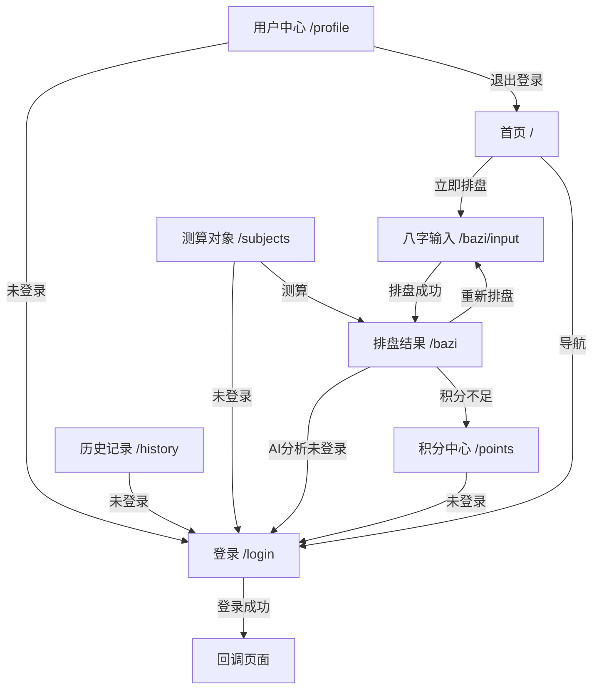

# 八字命理 - 前端产品需求文档 (PRD)

## 1. 项目概述

### 1.1 产品简介

八字命理是一个基于传统命理学与现代 AI 技术的命理分析平台，为用户提供精准的八字排盘和深度命理解读服务。

### 1.2 技术栈

- **框架**: Next.js 14 (App Router)
- **UI 风格**: Prismo 现代简约风格
- **样式**: Tailwind CSS + CSS Variables
- **状态管理**: React Hooks + SessionStorage
- **认证**: NextAuth.js
- **动画**: Framer Motion
- **字体**: Noto Sans SC (中文) + Geist (英文)

### 1.3 设计风格

- 悬浮胶囊式导航栏
- 彩色椭圆渐变背景
- 毛玻璃卡片效果 (Glass Morphism)
- 现代无衬线字体
- 渐变色强调元素

---

## 2. 页面结构总览

| 页面路径 | 页面名称 | 认证要求 | 描述 |
|---------|---------|---------|------|
| `/` | 首页 | 否 | 产品介绍与入口 |
| `/login` | 登录/注册 | 否 | 用户认证 |
| `/bazi/input` | 八字输入 | 否 | 出生信息输入 |
| `/bazi` | 排盘结果 | 否 (AI分析需登录) | 八字命盘展示 |
| `/history` | 历史记录 | 是 | 分析报告列表 |
| `/points` | 积分中心 | 是 | 积分充值与明细 |
| `/profile` | 用户中心 | 是 | 账户管理 |
| `/subjects` | 测算对象 | 是 | 管理测算对象 |

---

## 3. 全局组件

### 3.1 导航栏 (Header)

**文件位置**: `src/components/ui/header.tsx`

**组件结构**:

```jsx
<nav fixed top-5 center z-1000>
  <Container flex justify-between bg-white rounded-full shadow>
    {/* Logo */}
    <Link to="/">
      <Icon>☯</Icon>
      <Text>八字命理</Text>
    </Link>

    {/* Desktop Navigation (md+) */}
    <NavList hidden-mobile>
      <NavItem to="/" active={pathname === "/"}>首页</NavItem>
      <NavItem to="/bazi">八字排盘</NavItem>
      <NavItem to="/history">历史记录</NavItem>
      <NavItem to="/points">积分充值</NavItem>
      <NavItem to="/profile">用户中心</NavItem>
    </NavList>
    <CTAButton to="/bazi/input">立即排盘</CTAButton>

    {/* Mobile Menu Button (< md) */}
    <HamburgerButton onClick={toggleMenu} />
  </Container>

  {/* Mobile Dropdown (AnimatePresence) */}
  {mobileMenuOpen && (
    <MobileMenu animated>
      <NavItem>...</NavItem>
      <CTAButton>立即排盘</CTAButton>
    </MobileMenu>
  )}
</nav>
```

**设计特点**:
- 悬浮胶囊式设计，距顶部 20px
- 白色背景 + 圆角 (border-radius: 100px)
- 阴影效果 `box-shadow: 0 4px 20px rgba(0,0,0,0.08)`

**响应式行为**:
- 桌面端 (≥768px): 水平导航 + CTA 按钮
- 移动端 (<768px): 汉堡菜单 + 下拉面板动画

---

## 4. 首页 (`/`)

**文件位置**: `src/app/page.tsx`

### 4.1 组件结构

```jsx
<Page minHeight="100vh" bg="light-95">
  <Section hero minHeight="100vh" flex-col>
    {/* 背景层 */}
    <PrismoHeroBackground>
      <EllipseGradients />      {/* 彩色椭圆: 紫/粉/橙/红 */}
      <GridLines />             {/* 垂直网格线 */}
      <GradientOverlayTop />    {/* 顶部渐变遮罩 */}
      <GradientOverlayBottom /> {/* 底部渐变遮罩 */}
      <NoiseTexture />          {/* 噪点纹理 */}
    </PrismoHeroBackground>

    {/* 内容层 */}
    <HeroContent z-10 flex-1 center>
      <motion.div animated fadeInUp>
        {/* 徽章 */}
        <Badge glassmorphism>
          <GradientText>1000+</GradientText>
          <Text>用户信赖</Text>
        </Badge>

        {/* 标题 */}
        <H1 size="56px" weight="600">AI 智能命理分析</H1>

        {/* 副标题 */}
        <Subtitle size="18px" color="grey">
          基于传统八字命理与现代 AI 技术
          为您提供精准、深刻的命理解读
        </Subtitle>

        {/* CTA 按钮 */}
        <PillButton to="/bazi/input" variant="dark" size="lg">
          立即排盘
        </PillButton>

        {/* 评分 */}
        <Rating>
          <Stars count={5} filled />
          <Text>5.0 评分</Text>
        </Rating>
      </motion.div>
    </HeroContent>

    {/* 页脚 */}
    <Footer z-10 py-6 center>
      <Text size="13px" color="grey">© 2026 八字命理</Text>
    </Footer>
  </Section>
</Page>
```

### 4.2 展示信息

| 元素 | 内容 | 样式 |
|-----|------|------|
| 徽章 | "1000+ 用户信赖" | 渐变文字 + 毛玻璃背景 |
| 主标题 | "AI 智能命理分析" | 56px, font-weight: 600 |
| 副标题 | "基于传统八字命理与现代 AI 技术，为您提供精准、深刻的命理解读" | 18px, 灰色 |
| CTA | "立即排盘" | 深色胶囊按钮 |
| 评分 | 5星 + "5.0 评分" | 金色星星图标 |

### 4.3 跳转逻辑

| 触发元素 | 目标页面 |
|---------|---------|
| "立即排盘" 按钮 | `/bazi/input` |
| 导航栏 Logo | `/` (刷新) |

### 4.4 后端交互

无 (纯静态页面)

---

## 5. 登录/注册页 (`/login`)

**文件位置**: `src/app/login/page.tsx`

### 5.1 组件结构

```jsx
<Page minHeight="100vh" center>
  <PageTransition>
    <StaggerItem>
      <GlassCard padding="lg">
        {/* 头部 */}
        <Header center>
          <Link to="/">
            <Icon>☯</Icon>
            <GradientText>八字命理</GradientText>
          </Link>
          <H1>{loginMode === "phone" ? "登录 / 注册" : formMode}</H1>
        </Header>

        {/* 登录模式切换 */}
        <TabSwitch bg="black/5" rounded-full>
          <Tab active={loginMode === "phone"} onClick={setPhone}>
            手机号登录
          </Tab>
          <Tab active={loginMode === "username"} onClick={setUsername}>
            账号密码
          </Tab>
        </TabSwitch>

        {/* 手机号登录表单 */}
        {loginMode === "phone" && (
          <Form onSubmit={handlePhoneLogin}>
            <FormField label="手机号">
              <Input type="tel" maxLength={11} />
            </FormField>
            <FormField label="验证码">
              <Row>
                <Input type="text" maxLength={6} />
                <Button onClick={handleSendCode} disabled={countdown > 0}>
                  {countdown > 0 ? `${countdown}s` : "获取验证码"}
                </Button>
              </Row>
            </FormField>
            {error && <ErrorMessage animated>{error}</ErrorMessage>}
            {success && <SuccessMessage animated>{success}</SuccessMessage>}
            <PillButton type="submit" fullWidth>登录</PillButton>
            <HelpText center>
              新用户首次登录自动注册
              注册即送 100 积分
            </HelpText>
          </Form>
        )}

        {/* 账号密码表单 */}
        {loginMode === "username" && (
          <>
            <SubTabSwitch>
              <Tab active={formMode === "login"}>登录</Tab>
              <Tab active={formMode === "register"}>注册</Tab>
            </SubTabSwitch>
            <Form onSubmit={formMode === "login" ? handleLogin : handleRegister}>
              <FormField label="用户名">
                <Input type="text" />
              </FormField>
              <FormField label="密码">
                <Input type="password" />
              </FormField>
              {formMode === "register" && (
                <FormField label="确认密码">
                  <Input type="password" />
                </FormField>
              )}
              <PillButton type="submit" fullWidth>
                {formMode === "login" ? "登录" : "注册"}
              </PillButton>
            </Form>
          </>
        )}
      </GlassCard>
    </StaggerItem>

    {/* 返回首页 */}
    <StaggerItem>
      <Link to="/" center>
        <Icon>←</Icon> 返回首页
      </Link>
    </StaggerItem>
  </PageTransition>
</Page>
```

### 5.2 登录模式

#### 5.2.1 手机号登录 (默认)

| 字段 | 类型 | 验证规则 |
|-----|------|---------|
| 手机号 | tel | 11位中国手机号 `/^1[3-9]\d{9}$/` |
| 验证码 | text | 6位数字 |

**流程**:
1. 输入手机号
2. 点击"获取验证码" → 调用 API
3. 输入验证码
4. 点击"登录" → 认证成功后跳转

#### 5.2.2 账号密码登录/注册

| 字段 | 类型 | 验证规则 |
|-----|------|---------|
| 用户名 | text | 字母开头，3-20位字母/数字/下划线 |
| 密码 | password | 至少6位 |
| 确认密码 (注册) | password | 与密码一致 |

### 5.3 后端交互

| 操作 | API | 方法 | 请求体 | 响应 |
|-----|-----|------|-------|------|
| 发送验证码 | `/api/auth/send-code` | POST | `{ phone }` | `{ success, message, code? }` |
| 手机号登录 | NextAuth `phone-credentials` | - | `{ phone, code }` | Session |
| 账号登录 | NextAuth `username-credentials` | - | `{ username, password }` | Session |
| 账号注册 | `/api/auth/register` | POST | `{ username, password }` | `{ success, userId }` |

### 5.4 跳转逻辑

| 场景 | 目标 |
|-----|------|
| 登录成功 | `callbackUrl` 参数或 `/bazi` |
| 点击"返回首页" | `/` |
| 注册成功 | 自动登录后跳转 |

### 5.5 状态管理

- 60秒验证码倒计时
- 错误/成功消息提示
- 加载状态 (按钮禁用 + spinner)

---

## 6. 八字输入页 (`/bazi/input`)

**文件位置**: `src/app/bazi/input/page.tsx`

### 6.1 组件结构

```jsx
<Page minHeight="100vh" pt="100px" px="4">
  <Container maxWidth="6xl">
    <PageTransition>
      {/* 页面标题 */}
      <StaggerItem center mb="12">
        <H1><GradientText>八字排盘</GradientText></H1>
        <Subtitle>输入出生信息，探寻生命密码</Subtitle>
      </StaggerItem>

      {/* 输入表单 */}
      <StaggerItem>
        <UnifiedInputForm onCalculate={handleCalculate} />
      </StaggerItem>
    </PageTransition>
  </Container>
</Page>

{/* UnifiedInputForm 内部结构 */}
<GlassCard padding="lg" maxWidth="4xl" relative>
  {/* 装饰性渐变 blob */}
  <DecorativeBlob position="top-right" gradient="orange-rose" />
  <DecorativeBlob position="bottom-left" gradient="violet-indigo" />

  <Content z-10>
    <H2 center>输入您的出生信息</H2>

    {/* 基础开关 - 两列 */}
    <Grid cols={2} gap="8" mb="8">
      <FormField label="性别">
        <GlassSwitch options={["男", "女"]} />
      </FormField>
      <FormField label="历法">
        <GlassSwitch options={["公历 (阳历)", "农历 (阴历)"]} />
      </FormField>
    </Grid>

    {/* 日期选择 - 三列 */}
    <Grid cols={3} gap="3" mb="6">
      <FormField label="年份">
        <GlassSelect options={YEARS} />
      </FormField>
      <FormField label="月份">
        <GlassSelect options={MONTHS} />
      </FormField>
      <FormField label="日期">
        <GlassSelect options={DAYS} />
      </FormField>
    </Grid>

    {/* 时间选择 - 两列 */}
    <Grid cols={2} gap="4" mb="8">
      <FormField label="出生时辰 (24小时制)">
        <GlassSelect options={HOURS} />
      </FormField>
      <FormField label="分钟 (可选)">
        <GlassSelect options={MINUTES} />
      </FormField>
    </Grid>

    {/* 地点选择 */}
    <FormField mb="8">
      <LocationSelect />
      <HelpText>* 即使不确定准确时间，也请填写大致出生地点，将用于真太阳时校正。</HelpText>
    </FormField>

    {/* 闰月 (农历时显示) */}
    {calendarType === "lunar" && (
      <Checkbox label="是否为闰月" />
    )}

    {/* 提交按钮 */}
    <PillButton onClick={handleSubmit} fullWidth size="lg">
      排布命盘
    </PillButton>

    {error && <ErrorMessage animated>{error}</ErrorMessage>}
  </Content>
</GlassCard>
```

### 6.2 输入字段

| 字段 | 组件 | 选项范围 | 必填 |
|-----|------|---------|------|
| 性别 | GlassSwitch | 男/女 | 是 |
| 历法 | GlassSwitch | 公历/农历 | 是 |
| 年份 | GlassSelect | 1920-当前年 (倒序) | 是 |
| 月份 | GlassSelect | 1-12月 | 是 |
| 日期 | GlassSelect | 1-31日 | 是 |
| 时辰 | GlassSelect | 0-23时 | 是 |
| 分钟 | GlassSelect | 0-59分 | 是 |
| 出生地点 | LocationSelect | 省市级联 | 是 |
| 闰月 | Checkbox | 是/否 | 否 (农历时显示) |

### 6.3 后端交互

| 操作 | API | 方法 | 请求体 | 响应 |
|-----|-----|------|-------|------|
| 排盘计算 | `/api/bazi/calculate` | POST | `{ year, month, day, hour, minute, calendarType, gender, location, isLeapMonth }` | `{ success, baziData }` |

### 6.4 跳转逻辑

| 场景 | 操作 |
|-----|------|
| 排盘成功 | 存储结果到 sessionStorage，跳转 `/bazi` |
| 排盘失败 | 显示错误提示 |

### 6.5 数据存储

```javascript
sessionStorage.setItem("baziResult", JSON.stringify({
  baziData: data.baziData,
  formData: formData,
}));
```

---

## 7. 排盘结果页 (`/bazi`)

**文件位置**: `src/app/bazi/page.tsx`

### 7.1 组件结构

```jsx
<Page minHeight="100vh" pt="100px" px="4">
  <Container maxWidth="6xl">
    {/* 页面标题 */}
    <PageTransition>
      <StaggerItem center mb="12">
        <H1><GradientText>八字命盘</GradientText></H1>
        <Subtitle>您的专属命理分析结果</Subtitle>
      </StaggerItem>
    </PageTransition>

    {/* 结果仪表盘 */}
    <motion.div animated fadeInUp>
      <BaziResultDashboard
        baziData={baziData}
        analysis={analysis}
        loadingAnalysis={analyzing}
        onAnalyze={handleAnalyze}
        userName={subjectName}
      />

      {/* 重新排盘链接 */}
      <Center mt="8">
        <Link onClick={handleNewCalculation} underline>
          重新排盘
        </Link>
      </Center>
    </motion.div>
  </Container>
</Page>

{/* BaziResultDashboard 内部结构 */}
<Dashboard maxWidth="5xl">
  {/* 命盘信息卡片 */}
  <GlassCard mb="8" center>
    <GradientBar top />
    <H2>{userName}的命盘</H2>
    <Row gap="4" color="muted">
      <Text>{lunarDate.yearInChinese}年 (属{shengXiao})</Text>
      <Text>{lunarDate.monthInChinese}月</Text>
      <Text>{lunarDate.dayInChinese}</Text>
    </Row>
    <Grid cols={3} gap="6" mt="4">
      <Stat label="胎元" value={taiYuan} />
      <Stat label="命宫" value={mingGong} />
      <Stat label="身宫" value={shenGong} />
    </Grid>
  </GlassCard>

  {/* 主要图表 - Bento Grid */}
  <BentoGrid cols={3} gap="lg" mb="8">
    <BentoGridItem colSpan={2}>
      <FourPillarsCard fourPillars={fourPillars} />
    </BentoGridItem>
    <BentoGridItem colSpan={1}>
      <FiveElementsCard data={fiveElements} />
    </BentoGridItem>
  </BentoGrid>

  {/* 大运时间轴 */}
  {yun && <DaYunTimeline yun={yun} />}

  {/* AI 分析区域 */}
  <AnalysisResult
    analysis={analysis}
    loading={loadingAnalysis}
    onAnalyze={onAnalyze}
  />
</Dashboard>
```

### 7.2 展示信息

#### 7.2.1 命盘信息卡片

| 信息 | 来源 |
|-----|------|
| 农历年月日 | `baziData.lunarDate` |
| 生肖 | `baziData.shengXiao` |
| 胎元 | `baziData.taiYuan` |
| 命宫 | `baziData.mingGong` |
| 身宫 | `baziData.shenGong` |

#### 7.2.2 四柱卡片

| 柱 | 天干 | 地支 |
|---|------|------|
| 年柱 | `fourPillars.year.heavenlyStem` | `fourPillars.year.earthlyBranch` |
| 月柱 | `fourPillars.month.heavenlyStem` | `fourPillars.month.earthlyBranch` |
| 日柱 | `fourPillars.day.heavenlyStem` | `fourPillars.day.earthlyBranch` |
| 时柱 | `fourPillars.hour.heavenlyStem` | `fourPillars.hour.earthlyBranch` |

#### 7.2.3 五行分布卡片

| 五行 | 数量 | 百分比 |
|-----|------|-------|
| 金 | `fiveElements.metal` | 计算百分比 |
| 木 | `fiveElements.wood` | 计算百分比 |
| 水 | `fiveElements.water` | 计算百分比 |
| 火 | `fiveElements.fire` | 计算百分比 |
| 土 | `fiveElements.earth` | 计算百分比 |

#### 7.2.4 大运时间轴

| 信息 | 来源 |
|-----|------|
| 起运年龄 | `baziData.yun.startAge` |
| 大运列表 | `baziData.yun.daYun[]` |

### 7.3 后端交互

| 操作 | API | 方法 | 请求体 | 响应 |
|-----|-----|------|-------|------|
| AI 分析 | `/api/fortune/analyze` | POST | `{ baziData, subjectId? }` | `{ success, analysis, reportId, pointsDeducted }` |

### 7.4 跳转逻辑

| 场景 | 目标 |
|-----|------|
| 未登录点击分析 | 弹窗确认 → `/login?callbackUrl=/bazi` |
| 积分不足 | 弹窗确认 → `/points` |
| 点击"重新排盘" | `/bazi/input` |
| 无数据访问 | 自动跳转 `/bazi/input` |

### 7.5 状态管理

- 从 sessionStorage 读取 `baziResult`
- 分析结果存储在组件 state
- 加载状态控制 UI

---

## 8. 历史记录页 (`/history`)

**文件位置**: `src/app/history/page.tsx`

### 8.1 组件结构

```jsx
<Page minHeight="100vh" pb="20">
  <Container maxWidth="6xl" px="4" py="12">
    <PageTransition>
      {/* 页面标题 */}
      <StaggerItem center mb="12">
        <H1><GradientText>历史记录</GradientText></H1>
        <Subtitle>查看您的命理分析报告</Subtitle>
      </StaggerItem>

      {/* 错误提示 */}
      {error && (
        <StaggerItem>
          <ErrorMessage animated>{error}</ErrorMessage>
        </StaggerItem>
      )}

      {/* 主内容区 - 1:2 布局 */}
      <StaggerItem>
        <TwoPanel ratio="1:2">
          {/* 左侧: 报告列表 (1/3) */}
          <Panel className="panel-list">
            <GlassCard padding="md" fullHeight>
              <H2 mb="4">报告列表</H2>
              <ScrollArea maxHeight="600px">
                {reports.map(report => (
                  <ReportListItem
                    key={report.id}
                    report={report}
                    selected={selectedReport?.id === report.id}
                    onClick={() => handleViewReport(report.id)}
                    onDelete={() => handleDelete(report.id)}
                  />
                ))}
                {reports.length === 0 && (
                  <EmptyState>暂无历史记录</EmptyState>
                )}
              </ScrollArea>
            </GlassCard>
          </Panel>

          {/* 右侧: 报告详情 (2/3) */}
          <Panel className="panel-detail">
            <AnimatePresence mode="wait">
              {loadingDetail ? (
                <GlassCard center minHeight="500px">
                  <Spinner />
                </GlassCard>
              ) : selectedReport ? (
                <GlassCard padding="lg" animated>
                  {/* 出生信息 */}
                  <Section borderBottom mb="6" pb="6">
                    <H3>出生信息</H3>
                    {subjectName && <Text color="purple">测算对象：{subjectName}</Text>}
                    <Text color="muted">{formatBirthInfo(birthInfo)}</Text>
                  </Section>

                  {/* 八字四柱 */}
                  <Section borderBottom mb="6" pb="6">
                    <H3>八字四柱</H3>
                    <Grid cols={4} gap="4">
                      {["年柱", "月柱", "日柱", "时柱"].map(pillar => (
                        <PillarCard key={pillar} label={pillar} data={...} />
                      ))}
                    </Grid>
                    <Text center mt="4">日主：{dayMaster}</Text>
                  </Section>

                  {/* 分析标签切换 */}
                  <Section mb="6">
                    <H3>命理分析</H3>
                    <TabGroup>
                      {ANALYSIS_TABS.map(tab => (
                        <Tab
                          key={tab.id}
                          active={activeTab === tab.id}
                          onClick={() => setActiveTab(tab.id)}
                        >
                          {tab.label}
                        </Tab>
                      ))}
                    </TabGroup>
                    <ContentBox glassmorphism>
                      <Text whitespace="pre-wrap">
                        {analysis[activeTab] || "暂无分析内容"}
                      </Text>
                    </ContentBox>
                  </Section>

                  {/* 元信息 */}
                  <Footer borderTop pt="4">
                    <Text color="muted">消耗积分：{pointsCost}</Text>
                    <Text color="muted">生成时间：{formatDate(createdAt)}</Text>
                  </Footer>
                </GlassCard>
              ) : (
                <GlassCard center minHeight="500px">
                  <EmptyIcon />
                  <Text color="muted">选择一条记录查看详情</Text>
                </GlassCard>
              )}
            </AnimatePresence>
          </Panel>
        </TwoPanel>
      </StaggerItem>
    </PageTransition>
  </Container>
</Page>
```

### 8.2 展示信息

#### 8.2.1 报告列表项

| 信息 | 描述 |
|-----|------|
| 测算对象名 | 如有关联 subject |
| 农历出生日期 | `birthInfo.yearInChinese年 monthInChinese月 dayInChinese` |
| 创建时间 | `createdAt` 格式化 |
| 删除按钮 | 图标按钮 |

#### 8.2.2 报告详情

| 区域 | 内容 |
|-----|------|
| 出生信息 | 测算对象名 + 农历日期 |
| 八字四柱 | 年月日时柱 + 日主 |
| 分析标签 | 性格/事业/财运/感情/综合 |
| 分析内容 | 对应标签的分析文本 |
| 元信息 | 消耗积分 + 生成时间 |

### 8.3 后端交互

| 操作 | API | 方法 | 请求体/参数 | 响应 |
|-----|-----|------|------------|------|
| 获取列表 | `/api/reports` | GET | `?page=1&limit=10` | `{ reports[], total, pagination }` |
| 获取详情 | `/api/reports/[id]` | GET | - | `{ report }` |
| 删除报告 | `/api/reports/[id]` | DELETE | - | `{ success }` |

### 8.4 跳转逻辑

| 场景 | 目标 |
|-----|------|
| 未登录 | `/login?callbackUrl=/history` |

### 8.5 状态管理

- 报告列表 `reports[]`
- 选中报告 `selectedReport`
- 当前分析标签 `activeTab`

---

## 9. 积分中心页 (`/points`)

**文件位置**: `src/app/points/page.tsx`

### 9.1 组件结构

```jsx
<Page minHeight="100vh">
  <Container maxWidth="6xl" px="4" py="12">
    <PageTransition>
      {/* 页面标题 */}
      <StaggerItem center mb="12">
        <H1>积分中心</H1>
        <Subtitle>管理您的积分余额和充值</Subtitle>
      </StaggerItem>

      {/* 余额卡片 */}
      <StaggerItem>
        <GlassCard padding="xl" center mb="8">
          <Text color="muted" size="lg">当前积分</Text>
          <GradientText size="6xl" weight="bold">
            {balance.toLocaleString()}
          </GradientText>
          <Text color="muted" size="sm">积分可用于命理分析服务</Text>
        </GlassCard>
      </StaggerItem>

      {/* 消息提示 */}
      {error && <ErrorMessage animated>{error}</ErrorMessage>}
      {success && <SuccessMessage animated>{success}</SuccessMessage>}

      {/* 充值套餐 */}
      <StaggerItem>
        <GlassCard padding="lg" mb="8">
          <H2 mb="6">充值套餐</H2>
          <Grid cols={4} gap="4" responsive>
            {packages.map((pkg, index) => (
              <motion.div
                key={pkg.id}
                animated
                whileHover={{ scale: 1.05 }}
                delay={0.1 * index}
              >
                <PackageCard hover>
                  <GradientText size="3xl" weight="bold">{pkg.points}</GradientText>
                  <Text color="muted" size="sm">积分</Text>
                  <Text size="xl" weight="semibold">{formatPrice(pkg.price)}</Text>
                  <PillButton
                    onClick={() => handlePurchase(pkg.id)}
                    disabled={purchasing === pkg.id}
                    size="sm"
                    fullWidth
                  >
                    {purchasing === pkg.id ? "处理中..." : "购买"}
                  </PillButton>
                </PackageCard>
              </motion.div>
            ))}
          </Grid>
        </GlassCard>
      </StaggerItem>

      {/* 积分明细 */}
      <StaggerItem>
        <GlassCard padding="lg">
          <H2 mb="6">积分明细</H2>
          <Stack gap="3">
            {transactions.map((tx, index) => (
              <motion.div key={tx.id} animated delay={0.05 * index}>
                <TransactionItem hover>
                  <Left>
                    <Text weight="medium">{tx.description}</Text>
                    <Text color="muted" size="sm">{formatDate(tx.createdAt)}</Text>
                  </Left>
                  <Right>
                    <Text
                      weight="semibold"
                      color={tx.type === "consume" ? "rose" : "emerald"}
                    >
                      {tx.type === "consume" ? "-" : "+"}{Math.abs(tx.amount)}
                    </Text>
                    <Text color="muted" size="sm">余额: {tx.balance}</Text>
                  </Right>
                </TransactionItem>
              </motion.div>
            ))}
          </Stack>
        </GlassCard>
      </StaggerItem>
    </PageTransition>
  </Container>
</Page>
```

### 9.2 展示信息

#### 9.2.1 余额卡片

| 信息 | 样式 |
|-----|------|
| 当前积分 | 大号渐变文字 |
| 说明文字 | 小号灰色 |

#### 9.2.2 充值套餐

| 套餐 | 积分 | 价格 |
|-----|------|------|
| 基础 | 100 | ¥10.00 |
| 标准 | 500 | ¥45.00 |
| 高级 | 1000 | ¥80.00 |
| 至尊 | 5000 | ¥350.00 |

#### 9.2.3 积分明细

| 字段 | 描述 | 样式 |
|-----|------|------|
| 类型 | 充值/赠送/消费 | 充值绿色，消费红色 |
| 金额 | +/- 数值 | 带符号 |
| 余额 | 交易后余额 | 灰色 |
| 描述 | 交易说明 | - |
| 时间 | 交易时间 | 格式化 |

### 9.3 后端交互

| 操作 | API | 方法 | 请求体 | 响应 |
|-----|-----|------|-------|------|
| 获取积分 | `/api/points` | GET | - | `{ balance, transactions[] }` |
| 获取套餐 | `/api/points/packages` | GET | - | `{ packages[] }` |
| 创建订单 | `/api/payment/create` | POST | `{ packageId, platform }` | `{ orderNo, payUrl }` |
| 模拟支付 | `/api/payment/mock-confirm` | POST | `{ orderNo }` | `{ success, pointsAdded }` |

### 9.4 跳转逻辑

| 场景 | 目标 |
|-----|------|
| 未登录 | `/login?callbackUrl=/points` |

---

## 10. 用户中心页 (`/profile`)

**文件位置**: `src/app/profile/page.tsx`

### 10.1 组件结构

```jsx
<Page minHeight="100vh">
  <Container maxWidth="4xl" px="4" py="12">
    <PageTransition>
      {/* 页面标题 */}
      <StaggerItem center mb="12">
        <H1>用户中心</H1>
        <Subtitle>管理您的账户信息</Subtitle>
      </StaggerItem>

      {/* 用户信息卡片 */}
      <StaggerItem>
        <GlassCard padding="lg" mb="8">
          {/* 用户头部 */}
          <Row gap="6" mb="8">
            <Avatar size="xl" gradient>☯</Avatar>
            <Column>
              <Text size="2xl" weight="semibold">{getDisplayName()}</Text>
              <Text color="muted">{isNewUser ? "新用户" : "已注册用户"}</Text>
            </Column>
          </Row>

          {/* 统计数据 - 三列 */}
          <Grid cols={3} gap="4">
            <StatCard glassmorphism center>
              <GradientText size="3xl" weight="bold">{stats.balance}</GradientText>
              <Text color="muted" size="sm">当前积分</Text>
            </StatCard>
            <StatCard glassmorphism center>
              <GradientText size="3xl" weight="bold">{stats.reportCount}</GradientText>
              <Text color="muted" size="sm">分析报告</Text>
            </StatCard>
            <StatCard glassmorphism center>
              <GradientText size="3xl" weight="bold">{stats.totalPointsSpent}</GradientText>
              <Text color="muted" size="sm">累计消费</Text>
            </StatCard>
          </Grid>
        </GlassCard>
      </StaggerItem>

      {/* 快捷操作 */}
      <StaggerItem>
        <GlassCard padding="lg" mb="8">
          <H2 mb="6">快捷操作</H2>
          <Grid cols={4} gap="4" responsive>
            <ActionCard to="/bazi" whileHover={{ scale: 1.05 }}>
              <Icon size="3xl">☯</Icon>
              <Text size="sm">八字排盘</Text>
            </ActionCard>
            <ActionCard to="/history" whileHover={{ scale: 1.05 }}>
              <Icon size="3xl">📜</Icon>
              <Text size="sm">历史记录</Text>
            </ActionCard>
            <ActionCard to="/points" whileHover={{ scale: 1.05 }}>
              <Icon size="3xl">💰</Icon>
              <Text size="sm">积分充值</Text>
            </ActionCard>
            <ActionCard onClick={handleLogout} whileHover={{ scale: 1.05 }}>
              <Icon size="3xl">🚪</Icon>
              <Text size="sm">{loggingOut ? "退出中..." : "退出登录"}</Text>
            </ActionCard>
          </Grid>
        </GlassCard>
      </StaggerItem>

      {/* 账户信息 */}
      <StaggerItem>
        <GlassCard padding="lg">
          <H2 mb="6">账户信息</H2>
          <Stack gap="4">
            {username && (
              <InfoRow borderBottom>
                <Text color="muted">用户名</Text>
                <Text>{username}</Text>
              </InfoRow>
            )}
            {phone && (
              <InfoRow borderBottom>
                <Text color="muted">手机号</Text>
                <Text>{maskPhone(phone)}</Text>
              </InfoRow>
            )}
            <InfoRow borderBottom>
              <Text color="muted">用户ID</Text>
              <Text mono color="muted">{userId.slice(0, 8)}...</Text>
            </InfoRow>
            <InfoRow>
              <Text color="muted">账户状态</Text>
              <Badge variant="success">正常</Badge>
            </InfoRow>
          </Stack>
        </GlassCard>
      </StaggerItem>

      {/* 移动端退出按钮 */}
      <StaggerItem className="md:hidden" mt="8">
        <PillButton
          onClick={handleLogout}
          variant="secondary"
          fullWidth
          className="text-rose border-rose"
        >
          {loggingOut ? "退出中..." : "退出登录"}
        </PillButton>
      </StaggerItem>
    </PageTransition>
  </Container>
</Page>
```

### 10.2 展示信息

#### 10.2.1 用户信息

| 信息 | 来源 | 处理 |
|-----|------|------|
| 头像 | 默认渐变 | ☯ 图标 |
| 显示名 | `session.user.username` 或 `phone` | 手机号脱敏 |
| 用户状态 | `session.user.isNewUser` | 新用户/已注册用户 |

#### 10.2.2 统计数据

| 统计项 | 来源 |
|-------|------|
| 当前积分 | `/api/points` → `balance` |
| 分析报告数 | `/api/reports` → `total` |
| 累计消费 | 计算 consume 类型交易总和 |

#### 10.2.3 快捷操作

| 操作 | 图标 | 链接 |
|-----|------|------|
| 八字排盘 | ☯ | `/bazi` |
| 历史记录 | 📜 | `/history` |
| 积分充值 | 💰 | `/points` |
| 退出登录 | 🚪 | `signOut()` |

### 10.3 后端交互

| 操作 | API | 方法 | 响应 |
|-----|-----|------|------|
| 获取积分 | `/api/points` | GET | `{ balance, transactions[] }` |
| 获取报告数 | `/api/reports` | GET | `{ total }` |
| 退出登录 | NextAuth `signOut` | - | 跳转首页 |

### 10.4 跳转逻辑

| 场景 | 目标 |
|-----|------|
| 未登录 | `/login?callbackUrl=/profile` |
| 退出登录 | `/` |

---

## 11. 测算对象页 (`/subjects`)

**文件位置**: `src/app/subjects/page.tsx`

### 11.1 组件结构

```jsx
<Page minHeight="100vh" bg="black">
  <BackgroundBeams opacity={0.3} />

  <Container maxWidth="4xl" px="4" py="12" z-10>
    <motion.div animated fadeInUp>
      {/* 头部 */}
      <Header flex justify-between mb="8">
        <Column>
          <H1><GradientText>测算对象</GradientText></H1>
          <Subtitle color="gray">管理您的测算对象，方便快速测算</Subtitle>
        </Column>
        <Button variant="primary" onClick={() => setShowForm(true)}>
          + 添加对象
        </Button>
      </Header>

      {/* 错误提示 */}
      {error && <ErrorMessage>{error}</ErrorMessage>}

      {/* 对象列表 */}
      {subjects.length === 0 ? (
        <GlassCard center padding="xl">
          <Text color="gray">还没有测算对象</Text>
          <Button variant="primary" onClick={() => setShowForm(true)}>
            创建第一个
          </Button>
        </GlassCard>
      ) : (
        <Stack gap="4">
          {subjects.map(subject => (
            <motion.div key={subject.id} animated>
              <GlassCard padding="md">
                <Row justify-between>
                  <Column>
                    <Row gap="3" mb="2">
                      <H3>{subject.name}</H3>
                      <Badge>{relationshipLabel}</Badge>
                      <Badge>{subject.gender === "male" ? "男" : "女"}</Badge>
                    </Row>
                    <Text color="gray" size="sm">
                      {calendarType} {birthYear}年{birthMonth}月{birthDay}日 {time}
                    </Text>
                    <Text color="gray-darker" size="sm">{subject.location}</Text>
                    {subject.note && <Text color="gray-darkest" size="sm">{subject.note}</Text>}
                  </Column>
                  <Row gap="2">
                    <Button variant="purple" onClick={() => handleAnalyze(subject)}>测算</Button>
                    <Button variant="ghost" onClick={() => handleEdit(subject)}>编辑</Button>
                    <Button variant="danger-ghost" onClick={() => handleDelete(subject.id)}>删除</Button>
                  </Row>
                </Row>
              </GlassCard>
            </motion.div>
          ))}
        </Stack>
      )}

      {/* 添加/编辑弹窗 */}
      <AnimatePresence>
        {showForm && (
          <Modal animated onClose={() => setShowForm(false)}>
            <GlassCard padding="lg" maxWidth="2xl" scrollable>
              <H2 mb="6">{editingSubject ? "编辑测算对象" : "添加测算对象"}</H2>

              <Stack gap="6">
                {/* 姓名 & 关系 - 两列 */}
                <Grid cols={2} gap="4">
                  <FormField label="姓名/昵称" required>
                    <Input value={formData.name} />
                  </FormField>
                  <FormField label="关系">
                    <Select options={RELATIONSHIP_OPTIONS} />
                  </FormField>
                </Grid>

                {/* 性别 */}
                <FormField label="性别">
                  <ButtonGroup>
                    <Button active={gender === "male"} color="blue">男</Button>
                    <Button active={gender === "female"} color="pink">女</Button>
                  </ButtonGroup>
                </FormField>

                {/* 日期类型 */}
                <FormField label="日期类型">
                  <ButtonGroup>
                    <Button active={calendarType === "solar"} color="purple">公历</Button>
                    <Button active={calendarType === "lunar"} color="purple">农历</Button>
                  </ButtonGroup>
                </FormField>

                {/* 出生日期 - 三列 */}
                <Grid cols={3} gap="4">
                  <FormField label="年"><Select options={years} /></FormField>
                  <FormField label="月"><Select options={months} /></FormField>
                  <FormField label="日"><Select options={days} /></FormField>
                </Grid>

                {/* 闰月 (农历时显示) */}
                {calendarType === "lunar" && (
                  <Checkbox label="闰月" checked={isLeapMonth} />
                )}

                {/* 出生时间 - 两列 */}
                <Grid cols={2} gap="4">
                  <FormField label="时"><Select options={hours} /></FormField>
                  <FormField label="分"><Select options={minutes} /></FormField>
                </Grid>

                {/* 出生地点 */}
                <FormField label="出生地点" required>
                  <LocationSelect />
                </FormField>

                {/* 备注 */}
                <FormField label="备注">
                  <Textarea rows={2} placeholder="可选备注信息" />
                </FormField>

                {/* 按钮 */}
                <Row gap="4" pt="4">
                  <Button variant="ghost" flex="1" onClick={() => setShowForm(false)}>
                    取消
                  </Button>
                  <Button variant="primary" flex="1" onClick={handleSubmit} disabled={saving}>
                    {saving ? "保存中..." : "保存"}
                  </Button>
                </Row>
              </Stack>
            </GlassCard>
          </Modal>
        )}
      </AnimatePresence>
    </motion.div>
  </Container>
</Page>
```

### 11.2 展示信息

#### 11.2.1 对象列表项

| 信息 | 描述 |
|-----|------|
| 姓名 | 对象名称 |
| 关系标签 | 本人/家人/朋友/其他 |
| 性别标签 | 男/女 |
| 出生日期 | 公历/农历 + 年月日时分 |
| 出生地点 | 省市 |
| 备注 | 可选 |

#### 11.2.2 表单字段

| 字段 | 类型 | 必填 |
|-----|------|------|
| 姓名 | text | 是 |
| 关系 | select | 是 |
| 性别 | radio | 是 |
| 日期类型 | radio | 是 |
| 年月日时分 | select | 是 |
| 闰月 | checkbox | 否 |
| 出生地点 | LocationSelect | 是 |
| 备注 | textarea | 否 |

### 11.3 后端交互

| 操作 | API | 方法 | 请求体 | 响应 |
|-----|-----|------|-------|------|
| 获取列表 | `/api/subjects` | GET | `?limit&offset` | `{ subjects[], total }` |
| 创建对象 | `/api/subjects` | POST | `CreateSubjectInput` | `{ success, subject }` |
| 获取详情 | `/api/subjects/[id]` | GET | - | `{ subject, reportCount }` |
| 更新对象 | `/api/subjects/[id]` | PUT | `UpdateSubjectInput` | `{ success, subject }` |
| 删除对象 | `/api/subjects/[id]` | DELETE | - | `{ success }` |

### 11.4 跳转逻辑

| 场景 | 目标 |
|-----|------|
| 未登录 | `/login?callbackUrl=/subjects` |
| 点击"测算" | `/bazi?subjectId=xxx&name=xxx` |

---

## 12. API 接口汇总

### 12.1 认证相关

| 端点 | 方法 | 描述 | 认证 |
|-----|------|------|------|
| `/api/auth/send-code` | POST | 发送验证码 | 否 |
| `/api/auth/register` | POST | 用户名注册 | 否 |
| `/api/auth/[...nextauth]` | ALL | NextAuth 处理 | - |

### 12.2 八字相关

| 端点 | 方法 | 描述 | 认证 |
|-----|------|------|------|
| `/api/bazi/calculate` | POST | 八字排盘计算 | 否 |
| `/api/fortune/analyze` | POST | AI 命理分析 | 是 |

### 12.3 积分相关

| 端点 | 方法 | 描述 | 认证 |
|-----|------|------|------|
| `/api/points` | GET | 获取积分余额和明细 | 是 |
| `/api/points/packages` | GET | 获取充值套餐 | 否 |

### 12.4 支付相关

| 端点 | 方法 | 描述 | 认证 |
|-----|------|------|------|
| `/api/payment/create` | POST | 创建支付订单 | 是 |
| `/api/payment/mock-confirm` | POST | 模拟支付确认 (开发) | 是 |
| `/api/payment/status/[orderNo]` | GET | 查询订单状态 | 是 |

### 12.5 报告相关

| 端点 | 方法 | 描述 | 认证 |
|-----|------|------|------|
| `/api/reports` | GET | 获取报告列表 | 是 |
| `/api/reports/[id]` | GET | 获取报告详情 | 是 |
| `/api/reports/[id]` | DELETE | 删除报告 (软删除) | 是 |

### 12.6 测算对象相关

| 端点 | 方法 | 描述 | 认证 |
|-----|------|------|------|
| `/api/subjects` | GET | 获取对象列表 | 是 |
| `/api/subjects` | POST | 创建对象 | 是 |
| `/api/subjects/[id]` | GET | 获取对象详情 | 是 |
| `/api/subjects/[id]` | PUT | 更新对象 | 是 |
| `/api/subjects/[id]` | DELETE | 删除对象 | 是 |
| `/api/subjects/[id]/reports` | GET | 获取对象的报告 | 是 |

---

## 13. 页面跳转流程图



---

## 14. 错误处理

### 14.1 网络错误

- 显示 "网络错误，请稍后重试" 提示
- 保留用户输入数据

### 14.2 认证错误

- 401: 跳转登录页，携带 callbackUrl
- 显示 "请先登录" 提示

### 14.3 业务错误

- 400: 显示具体错误信息
- 402 (积分不足): 弹窗确认跳转充值
- 404: 显示 "资源不存在"
- 500: 显示 "服务器错误，请稍后重试"

---

## 15. 响应式设计断点

| 断点 | 宽度 | 应用 |
|-----|------|------|
| sm | ≥640px | 小型设备 |
| md | ≥768px | 平板/导航切换 |
| lg | ≥1024px | 桌面端 |
| xl | ≥1280px | 大屏桌面 |

---

## 16. 版本信息

- **文档版本**: 1.1.0
- **最后更新**: 2026-01-10
- **作者**: AI Assistant
